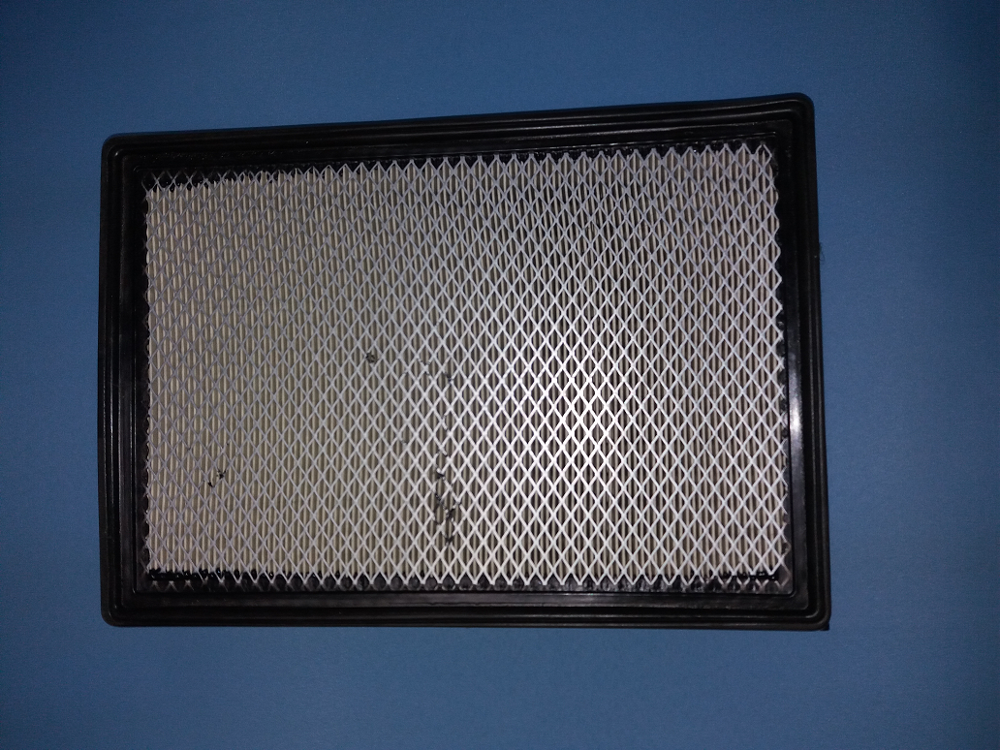
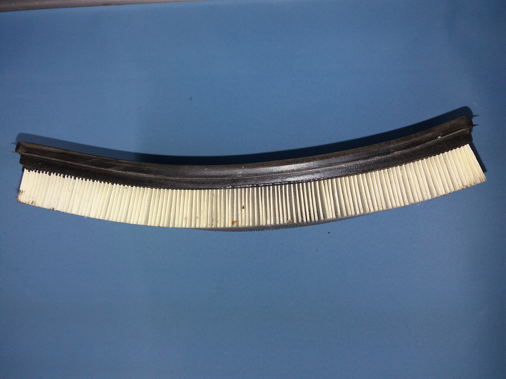
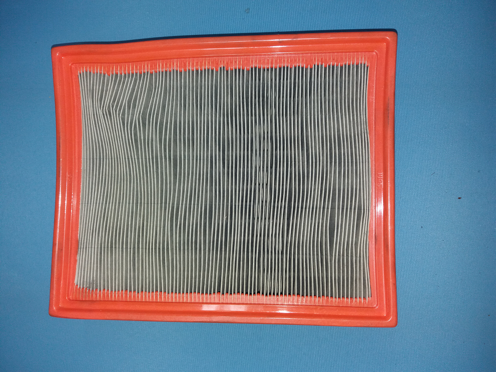
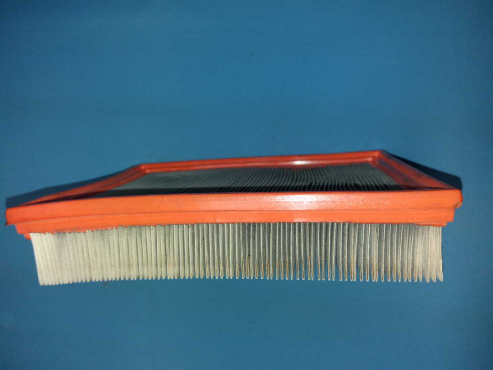
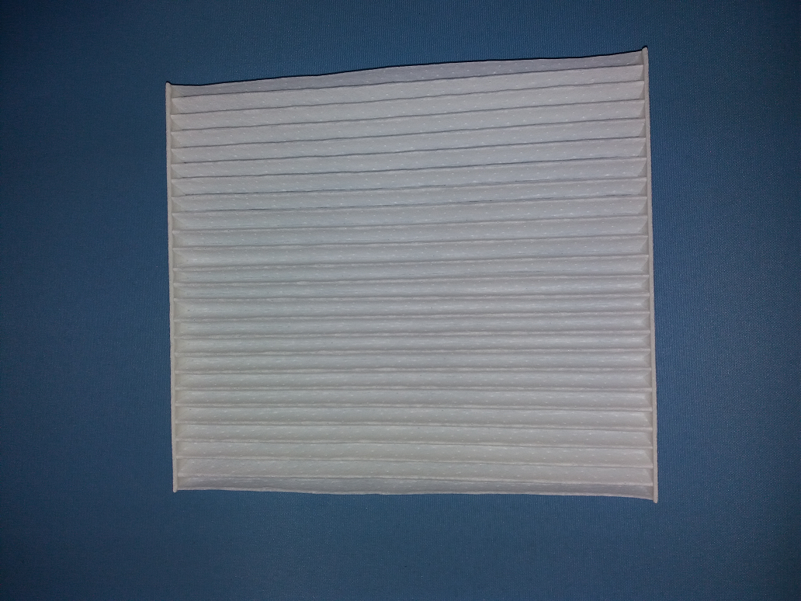
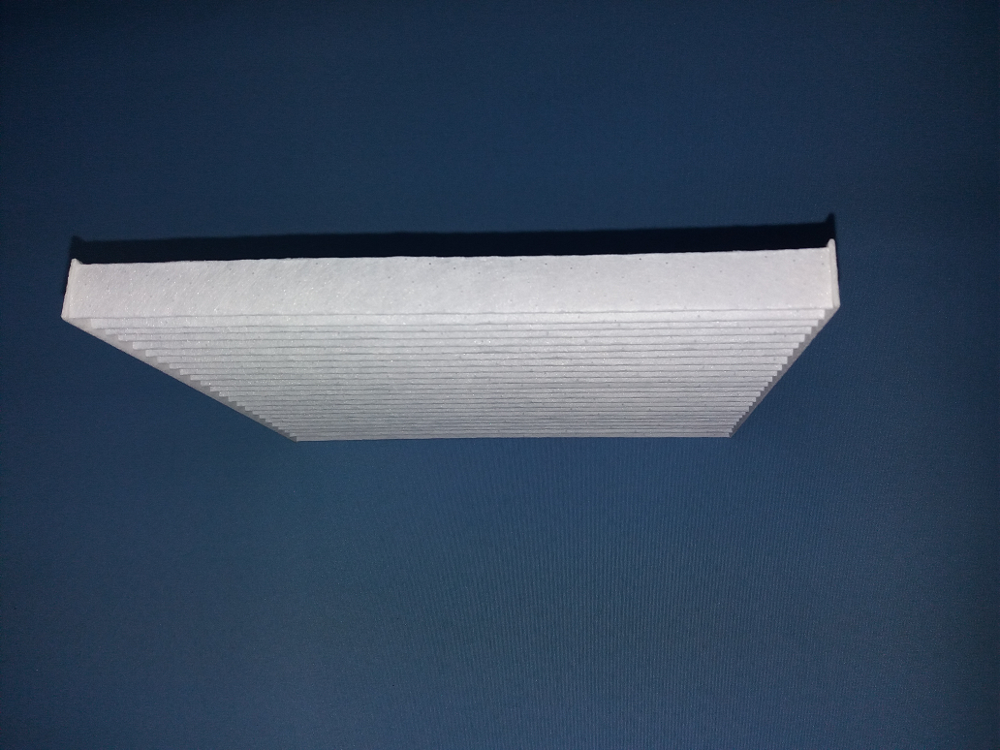

:kr: 미세먼지를 분산처리하여 제거하자...  

---
# 미세먼지를 걸러서 공기를 깨끗하게...

---
# 모든 자동차에 미세먼지 필터를 달자

---
## 1. 대기중 미세먼지를 제거(저감)하기 위한 단장기 대책

우리가 일상적으로 이용하는 자동차로 대기중의 미세먼지를 분산처리하여 미세먼지를 제거한다.

- 승용차, 버스, 화물차 등에서 버려지는 다양한 종류의 에어필터를 재활용하여 미세먼지를 제거한다.
- 정기검사시 대상차량에 대한 미세먼지 정화기 검사항목 추가하여 지속적 관리

### 단계 1: 공공기관에 등록된 자동차에 미세먼지 정화기 의무 장착

### 단계 2: 대중교통수단인 지하철, 버스, 택시에 미세먼지 정화기 의무 장착

### 단계 3: 개인용 자동차는 자율적으로 미세먼지 정화기를 장착
- 장착 차량은 세금감면등의 혜택 부여

### 단계 4: 국내에 신규로 출하되는 모든 차량에 미세먼지 정화기 의무장착법 제정 및 시행

### 단계 5: 주변국가에 상기 사항을 적용하도록 국제 협약

---
## 2. 대기중의 미세먼지 농도가 높아지는 원인

- 국내에서 발생되는 각종 오염물질  
> ```
> - 공업, 산업활동에 의해 생성된 대기 오염물질
> - 자동차에서 배출되는 연소 오염물질
> - 자동차 타이어, 브레이크에서 생성되는 분진
> ```

- 중국에서 불어오는 바람을 타고 한국으로 유입  
> ```
> - 사막에서 생성된 모래바람
> - 공업, 산업활동에 의해 생성된 대기 오염물질
> - 동절기 난방용 화석연료로 인해 발생된 오염물질
> - 자동차에서 배출되는 연소 오염물질
> - 자동차 타이어, 브레이크에서 생성되는 분진
> ```

---
- 다양한 공기필터(재사용)

| 종류 | 상면사진 | 측면사진 |  
| ------------ | :------------: | :------------: |  
| 필터 가 |  |  |  
| 필터 나 |  |  |  
| 필터 다 |  |  |


| 종류 | 상면사진 | 측면사진 |  
| ------------ | :------------: | :------------: |  
| 필터 가 | <p align="center"></p> | <p align="center"></p> |  
| 필터 나 | <p align="center"></p> | <p align="center"></p> |  
| 필터 다 | <p align="center"></p> | <p align="center"></p> |  


---

## 1. 차량용 미세먼지 정화기 만들기

### 준비물

- 판재
- 필터
- 팬
- 전선

## 2. 자동차에 정화기 설치

## 3. 정화기 효과 확인

----


